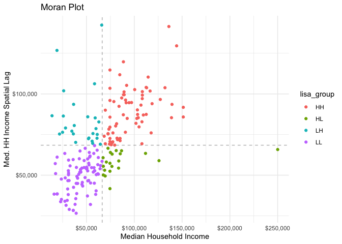

<!-- README.md is generated from README.Rmd. Please edit that file -->

# sfweight

<!-- badges: start -->
<!-- badges: end -->

The goal of sfweight is to create a tidier and more streamlined
interface to the spdep package. The spdep package has an idiosyncratic
syntax that can be difficult to fit into a typical data science
workflow. sfweight creates a simpler interface to the spdep package.

The intention behind sfweight is implement a simpler, but stricter
workflow that enables the creation of neighbors, spatial weights, and
spatially lagged variables. This will be accomplished by decoupling
neighbors from weights and utilizing list objects.

sfweight uses sf objects whereas spdep is more flexible with the types
of input objects vaialable.

## Installation

You can install the development version from GitHub with

``` r
remotes::install_github("Josiahparry/sfweight")
```

## Motivating examples

### Spatial OLS

We can fit a spatial Durbin model by calculating spatially lagged
predictors.

``` r
library(sfweight)
library(tidyverse)

acs_lagged <- acs %>% 
  mutate(nb = st_neighbors(geometry),
         wts = st_weights(nb),
         trans_lag = st_lag(by_pub_trans, nb, wts),
         bach_lag = st_lag(bach, nb, wts))


durbin_lm <- lm(med_house_income ~ trans_lag + by_pub_trans + bach_lag + bach, 
   data = acs_lagged)

broom::tidy(durbin_lm)
#> # A tibble: 5 x 5
#>   term         estimate std.error statistic  p.value
#>   <chr>           <dbl>     <dbl>     <dbl>    <dbl>
#> 1 (Intercept)    56187.     9812.     5.73  3.76e- 8
#> 2 trans_lag     -13479.    28078.    -0.480 6.32e- 1
#> 3 by_pub_trans  -43067.    18841.    -2.29  2.33e- 2
#> 4 bach_lag      -40154.    28287.    -1.42  1.57e- 1
#> 5 bach          153955.    21490.     7.16  1.51e-11
```

### Local Autocorrelation

We can create a Moran plot by creating a spatially lagged variable.
Additionally the function `categorize_lisa()` will categorize high-high,
high-low, etc., groupings of these variables.

``` r
acs_lagged %>% 
  mutate(inc_lag = st_lag(med_house_income, nb, wts),
         lisa_group = categorize_lisa(med_house_income, inc_lag)) %>% 
  ggplot(aes(med_house_income, inc_lag, color = lisa_group)) +
  geom_vline(aes(xintercept = mean(med_house_income)), lty = 2, alpha = 1/3) +
  geom_hline(aes(yintercept = mean(inc_lag)), lty = 2, alpha = 1/3) + 
  geom_point() +
  labs(title = "Moran Plot",
       y = "Med. HH Income Spatial Lag",
       x = "Median Household Income") +
  theme_minimal() +
  scale_x_continuous(labels = scales::dollar) + 
  scale_y_continuous(labels = scales::dollar)
```



We can also calculate the Local Moran’s I for each observation using the
function `local_moran()` this will create a dataframe column containing
the I, expected I, variance, Z-value, and P-value for each observation.
You can extract this using `tidyr::unpack()`. In order to do so you need
to cast as a tibble then cast back to an sf object if you want to
maintain the sf class.

``` r
acs_lisa <- acs_lagged %>% 
  mutate(lisa = local_moran(bach, nb, wts)) %>% 
  as_tibble() %>% 
  unpack(lisa) 

acs_lisa %>% 
  select(last_col(4:0))
#> # A tibble: 203 x 5
#>         ii     e_ii var_ii    z_ii    p_ii
#>      <dbl>    <dbl>  <dbl>   <dbl>   <dbl>
#>  1  0.315  -0.00495  0.138  0.863  0.194  
#>  2 -0.137  -0.00495  0.328 -0.231  0.592  
#>  3  1.22   -0.00495  0.245  2.47   0.00678
#>  4 -0.253  -0.00495  0.161 -0.618  0.732  
#>  5 -0.0363 -0.00495  0.245 -0.0634 0.525  
#>  6  1.23   -0.00495  0.245  2.49   0.00637
#>  7  0.379  -0.00495  0.138  1.03   0.150  
#>  8  0.103  -0.00495  0.195  0.245  0.403  
#>  9  0.0474 -0.00495  0.494  0.0745 0.470  
#> 10  0.195  -0.00495  0.245  0.405  0.343  
#> # … with 193 more rows
```

``` r
library(sf)
#> Linking to GEOS 3.8.1, GDAL 3.1.4, PROJ 6.3.1
 
acs_lisa %>% 
  st_as_sf() %>% 
  ggplot(aes(fill = ii)) + 
  geom_sf(color = "black", lwd = 0.2) +
  scale_fill_binned(n.breaks = 5) + 
  theme_minimal()
```


## Basic usage & contiguities

``` r
str(acs)
#> sf[,5] [203 × 5] (S3: sf/tbl_df/tbl/data.frame)
#>  $ fips            : chr [1:203] "25025092101" "25025100603" "25025010103" "25025070402" ...
#>  $ med_house_income: num [1:203] 52924 86659 31218 25750 68500 ...
#>  $ by_pub_trans    : num [1:203] 0.3208 0.0945 0.1815 0.2229 0.199 ...
#>  $ bach            : num [1:203] 0.124 0.305 0.405 0.141 0.208 ...
#>  $ geometry        :sfc_MULTIPOLYGON of length 203; first list element: List of 1
#>   ..$ :List of 1
#>   .. ..$ : num [1:136, 1:2] -71.1 -71.1 -71.1 -71.1 -71.1 ...
#>   ..- attr(*, "class")= chr [1:3] "XY" "MULTIPOLYGON" "sfg"
#>  - attr(*, "sf_column")= chr "geometry"
#>  - attr(*, "agr")= Factor w/ 3 levels "constant","aggregate",..: NA NA NA NA
#>   ..- attr(*, "names")= chr [1:4] "fips" "med_house_income" "by_pub_trans" "bach"
```

We can get neighbors based on Queen contiguities with `st_neighbors()`.

``` r
nbs <- st_neighbors(acs)

nbs[1:5]
#> [[1]]
#> [1]   2  15 168 171 172 179 180
#> 
#> [[2]]
#> [1]   1  71 180
#> 
#> [[3]]
#> [1]  45  50  92 122
#> 
#> [[4]]
#> [1]  30  84 127 135 136 138
#> 
#> [[5]]
#> [1]  34  87 100 108
```

If needed, we can also identify the cardinalities from the neighbors
list as well.

``` r
st_cardinalties(nbs)
#>   [1]  7  3  4  6  4  4  7  5  2  4  8  5  6  1  9  5  4  6  5  8  8  3  5  7  4
#>  [26]  5  3  4  4  4  4  6  4  5  6  5  8  7  5  2  8  6  5 10  5  4  5  3  5  4
#>  [51]  3  9  4  7  6  7  4  6  7  7  4 10  5  6  5  5  4  4  9  4  3  4  3  4  3
#>  [76]  5  2  8  8 11  7  8  8  5  5  5  5  9  6  5  7 11 10  3  6  6  3  5  2  6
#> [101]  6  7  5  4  6  4  5  9  4  9  4  5  7  4  6  3  5  5  4  4  6  6  6  6  5
#> [126]  7  8  4  4  5  7  3  6  4 11  7  3  7  5  9  6  4  4  5  7  5  6  5  5  6
#> [151]  7  9  4  7  8  7  6  6  6  7  6  5  8  4  6  6  7  6  8  7  7  4  7  6  9
#> [176]  5  7  4  9  5  8  4  5  5  6  6  5  5  6  3  5  6  6  6  5  3  5  6  6  6
#> [201]  3  5  6
```

We can get the weights from the neighbor contiguities as well. By
default, `st_weights()` uses row standardization.

``` r
wts <- st_weights(nbs)

wts[1:5]
#> [[1]]
#> [1] 0.1428571 0.1428571 0.1428571 0.1428571 0.1428571 0.1428571 0.1428571
#> 
#> [[2]]
#> [1] 0.3333333 0.3333333 0.3333333
#> 
#> [[3]]
#> [1] 0.25 0.25 0.25 0.25
#> 
#> [[4]]
#> [1] 0.1666667 0.1666667 0.1666667 0.1666667 0.1666667 0.1666667
#> 
#> [[5]]
#> [1] 0.25 0.25 0.25 0.25
```

We can also calculate the spatial lag with the weights and neighbors.

``` r
inc_lag <- st_lag(acs$med_house_income, nbs, wts)

inc_lag[1:5]
#> [1] 63968.57 65019.00 59271.38 86385.17 73962.88
```

## K-Nearest Neighbor Distances

If we have point data we can also identify the k-nearest neighbors with
`st_knn()`. For an example we can use the `airbnb` dataset that’s
imported with `sfweight`.

``` r
airbnb
#> Simple feature collection with 3799 features and 4 fields
#> Geometry type: POINT
#> Dimension:     XY
#> Bounding box:  xmin: -71.1728 ymin: 42.23576 xmax: -70.99595 ymax: 42.39549
#> Geodetic CRS:  WGS 84
#> # A tibble: 3,799 x 5
#>       id neighborhood room_type       price             geometry
#>  * <dbl> <chr>        <chr>           <dbl>          <POINT [°]>
#>  1  3781 East Boston  Entire home/apt   125 (-71.02991 42.36413)
#>  2  5506 Roxbury      Entire home/apt   145 (-71.09559 42.32981)
#>  3  6695 Roxbury      Entire home/apt   169 (-71.09351 42.32994)
#>  4  8789 Downtown     Entire home/apt    99 (-71.06265 42.35919)
#>  5 10730 Downtown     Entire home/apt   150  (-71.06185 42.3584)
#>  6 10813 Back Bay     Entire home/apt   179 (-71.08904 42.34961)
#>  7 10986 North End    Entire home/apt   125 (-71.05075 42.36352)
#>  8 16384 Beacon Hill  Private room       50  (-71.07132 42.3581)
#>  9 18711 Dorchester   Entire home/apt   154 (-71.06096 42.32212)
#> 10 22195 Back Bay     Private room      115  (-71.0793 42.34558)
#> # … with 3,789 more rows
```

``` r
airbnb_knn <- st_knn(airbnb)

airbnb_knn[1:5]
#> [[1]]
#> [1] 3091
#> 
#> [[2]]
#> [1] 21
#> 
#> [[3]]
#> [1] 2886
#> 
#> [[4]]
#> [1] 1068
#> 
#> [[5]]
#> [1] 203
```

## Other weights

Point based weights implemented based on Luc Anselin and Grant
Morrison’s
[notes](https://spatialanalysis.github.io/lab_tutorials/Spatial_Weights_as_Distance_Functions.html#kernal-weights).

Inverse distance band

``` r
airbnb_idw <- st_inverse_weights(airbnb$geometry, airbnb_knn)

airbnb_idw[1]
#> [[1]]
#>  [1]  72.85418  94.82628  80.81517  76.98118  77.47322 207.58305  90.54686
#>  [8] 140.95536  89.09559 130.49453 168.12971  76.88485 132.13504 169.34664
#> [15] 123.56357 110.04713 462.67599  73.68500 491.86866  88.92867  91.93710
#> [22] 391.89760  73.37702  81.09685 107.10884 139.86709  80.59692 111.15096
#> [29] 113.25885 126.51082 113.95462 107.27650 107.80669 108.08046 106.77599
#> [36]  98.56036  96.98179 105.01340  93.91173  91.75525  98.75033  94.91645
#> [43] 106.71431  86.72350 104.85322  80.03740  85.86828  78.68751  91.18164
#> [50]  80.82558  91.50620  87.66654  91.08201  78.62795 109.01413  94.83290
#> [57] 144.36684 133.21065 159.53591 121.62878 103.27084 108.61908 223.55088
#> [64] 132.34225  93.48938  98.53665 195.96026 272.30270  95.61728 150.25611
#> [71] 919.21712 113.75560 143.05836 135.91442 139.71490 106.91507 124.54847
#> [78] 153.71365 153.71365 153.71365 148.79092  74.75811
```

### Kernel based weights

Available kernels are:

-   uniform
-   triangular
-   epanechnikov
-   quartic
-   gaussian

``` r
airbnb_gauss <- st_kernel_weight(airbnb$geometry, airbnb_knn, "gaussian")

airbnb_gauss[1]
#> [[1]]
#>  [1] 2.506628 1.520893 1.866407 1.670106 1.602290 1.611395 2.357012 1.813899
#>  [9] 2.193421 1.794732 2.145140 2.282160 1.600493 2.153400 2.285228 2.106956
#> [17] 2.013664 2.475767 1.538029 2.479302 1.792480 1.831595 2.463717 1.531722
#> [25] 1.674815 1.989288 2.188852 1.666432 2.022398 2.038470 2.123876 2.043607
#> [33] 1.990725 1.995231 1.997536 1.986418 1.907777 1.890761 1.970839 1.855665
#> [41] 1.829317 1.909780 1.867452 1.985884 1.761789 1.969390 1.656914 1.749397
#> [49] 1.633347 1.822058 1.670281 1.826179 1.775132 1.820787 1.632287 2.005285
#> [57] 1.866483 2.207137 2.158667 2.258595 2.095253 1.954776 2.002027 2.377080
#> [65] 2.154424 1.850619 1.907527 2.339361 2.418562 1.875498 2.228826 2.498773
#> [73] 2.042146 2.201982 2.171412 2.188205 1.987620 2.112729 2.240502 2.240502
#> [81] 2.240502 2.223651 1.559591
```

## Higher order neighbors

``` r
acs %>% 
  transmute(nb = st_neighbors(geometry),
            nb_2 = st_neighbor_lag(nb, 2),
            nb_cumul_2 = st_neighbor_lag_cumul(nb, 2))
#> Simple feature collection with 203 features and 3 fields
#> Geometry type: MULTIPOLYGON
#> Dimension:     XY
#> Bounding box:  xmin: -71.19125 ymin: 42.22793 xmax: -70.9201 ymax: 42.45012
#> Geodetic CRS:  WGS 84
#> # A tibble: 203 x 4
#>    nb      nb_2     nb_cumul_2                                          geometry
#>  * <list>  <list>   <list>                                    <MULTIPOLYGON [°]>
#>  1 <int [… <int [1… <int [24]> (((-71.06249 42.29221, -71.06234 42.29273, -71.0…
#>  2 <int [… <int [6… <int [9]>  (((-71.05147 42.28931, -71.05136 42.28933, -71.0…
#>  3 <int [… <int [1… <int [17]> (((-71.11093 42.35047, -71.11093 42.3505, -71.11…
#>  4 <int [… <int [1… <int [24]> (((-71.06944 42.346, -71.0691 42.34661, -71.0688…
#>  5 <int [… <int [9… <int [13]> (((-71.13397 42.25431, -71.13353 42.25476, -71.1…
#>  6 <int [… <int [1… <int [16]> (((-71.04707 42.3397, -71.04628 42.34037, -71.04…
#>  7 <int [… <int [1… <int [20]> (((-71.01324 42.38301, -71.01231 42.38371, -71.0…
#>  8 <int [… <int [8… <int [13]> (((-71.00113 42.3871, -71.001 42.38722, -71.0007…
#>  9 <int [… <int [1… <int [16]> (((-71.05079 42.32083, -71.0506 42.32076, -71.05…
#> 10 <int [… <int [1… <int [15]> (((-71.11952 42.28648, -71.11949 42.2878, -71.11…
#> # … with 193 more rows
```
